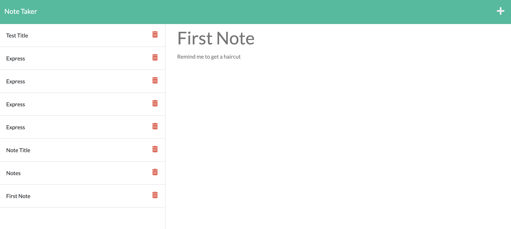

# Express.js: Note Taker

## Your Task

Program that modifies starter code to create an application called Note Taker that can be used to write and save notes. This application uses an Express.js back end and saves and retrieves note data from a JSON file. It also builds the back end, connect the two, and then deploys the entire application to Heroku.

## User Story

```
AS A small business owner
I WANT to be able to write and save notes
SO THAT I can organize my thoughts and keep track of tasks I need to complete
```

## Mock-Up

The following images show the web application's appearance and functionality:



## Links

- [Deployed Link](https://github.com/hyanez/NOTE-TAKER)
- [Github Link](https://hyanez.github.io/NOTE-TAKER/)
- [Heroku Link](https://watch.screencastify.com/v/7FhBRBSLd1e4N5TLz5Pk)
